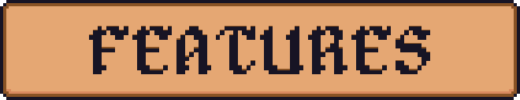
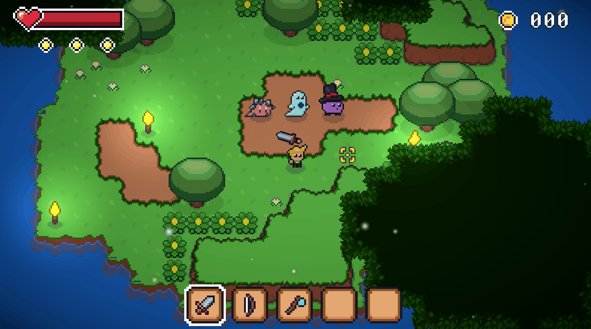

# 2D-RPG-Project

This is a 2D top-down game developed in Unity, primarily focused on exploring and implementing game feel techniques and advanced use of the Unity Editor alongside C# scripting.

The project includes multiple enemy types, bullet hell patterns, and interactable scenery elements. It serves as a learning-focused environment to experiment with responsive gameplay mechanics, efficient editor tooling, and scalable architecture.

## 🚀 Features

- 🔫 Multiple Enemy Types
  - Basic movement and chase logic
  - Bullet hell-style projectile systems
  - Customizable parameters for each enemy via ScriptableObjects or inspector controls
  

- 🎇 Bullet Hell System
  - Modular system to define projectile spread, patterns, timing, and direction
  - Parameterized from the Editor for quick iteration
  

- 🧱 Scenery and Environment Logic
  - Interactable objects
  - Dynamic effects and feedback
  - Editor tooling for positioning, grouping, and controlling behaviors
    

- 🎮 Game Feel Focus
  - Screen shake, hit pause
  - Smooth player movement and input buffering
  - Feedback-driven interactions
      

- 🛠️ Editor Tooling
  - Custom inspectors and attributes
  - Serialized fields for quick tuning
  - Organized folder structure and naming conventions

## 🎥 Demo


## 🛠️ Tech Stack
- Unity 6 (6000.0.30f1)
- C#
- URP
- GitHub

## 📦 Setup

```bash
git clone https://github.com/your-user/your-repo.git
